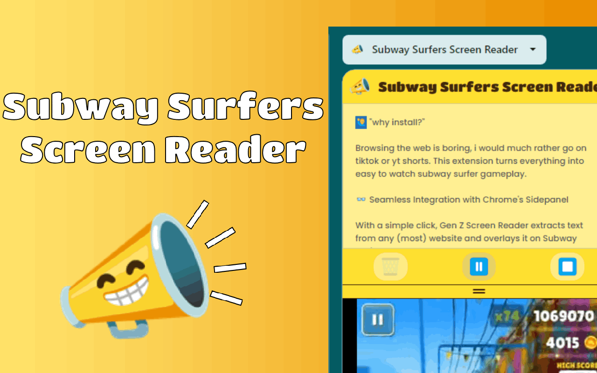

<h1 align="center"> Subway Surfers Screen Reader </h1>

Screen reader extension with subway surfers playing in the sidepanel.

 | <video src="https://github.com/user-attachments/assets/7fca8c54-1b72-43c0-af0a-71233902a4f7.mp4" />
-|-

## Installation

### Prerequisites
Note you muse have the following installed before proceeding:
* [Node](https://nodejs.org/en)
* [git](https://git-scm.com/downloads)
* [Chrome](https://www.google.com/chrome/)

To preview and develop the extension locallly follow these steps:

|   | Description                             | Action                                                                                     |
|---|-----------------------------------------|--------------------------------------------------------------------------------------------|
| 1 | Clone the repo in the terminal          |<pre><code>git clone https://github.com/Aebel-Shajan/subway_surfers_screen_reader.git</code></pre>              
| 2 | cd into project folder                  |<pre><code>cd subway_surfers_screen_reader</code></pre>
| 3 | Install the npm dependencies            |<pre><code>npm install </code></pre>                                                                             
| 4 | Build the extension                     |<pre><code>npm run build </code></pre>                                                                                 
| 5 | Open google chrome and go to the URL    |<pre><code>chrome://extensions </code></pre>                                                                   
| 6 | Enable developer mode                   |                     
| 7 | Load the extension                      |Click on `Load unpacked` and select the folder "subway_surfers_screen_reader/build"    

**🎉 The extension should be installed locally in chrome 🎉** 

<!-- Why not use a html table? Markdown tables have this property which disable overflow:scroll -->
## Usage

1. right click > click 'Read website'

or

1. select text > right click > click 'Read selection'

or

1. clicke the icon in the toolbar and past text into the sidepanel.

2. press play to start tts (disables text area)
3. press stop to stop tts (enables text area)

## Contributing

Contributions are welcome! If you find any issues or have suggestions for improvements, please open an issue or submit a pull request.
